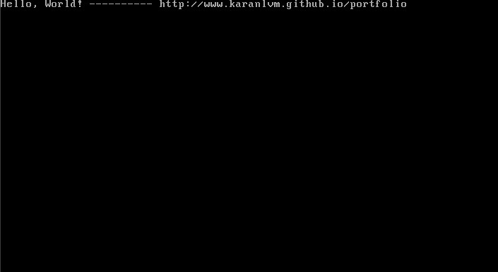

# ForgeOS

Here's an operating system that I have built from scratch to help me understand how a computer works.

When a computer starts, the BIOS loads the Master Boot Record (MBR), which holds the bootloader. For now, I'm using the GRUB bootloader to handle the initial boot process. While writing my own bootloader would be an exciting project, I've chosen to focus on the core components of the operating system at this stage.

Everything after the bootloader is my own work, and I've pushed the source code to this repository in the hope that it might help you understand the inner workings of operating systems. Feel free to explore the code, learn from it, and contribute if you're interested!

Here's what I have so far -

